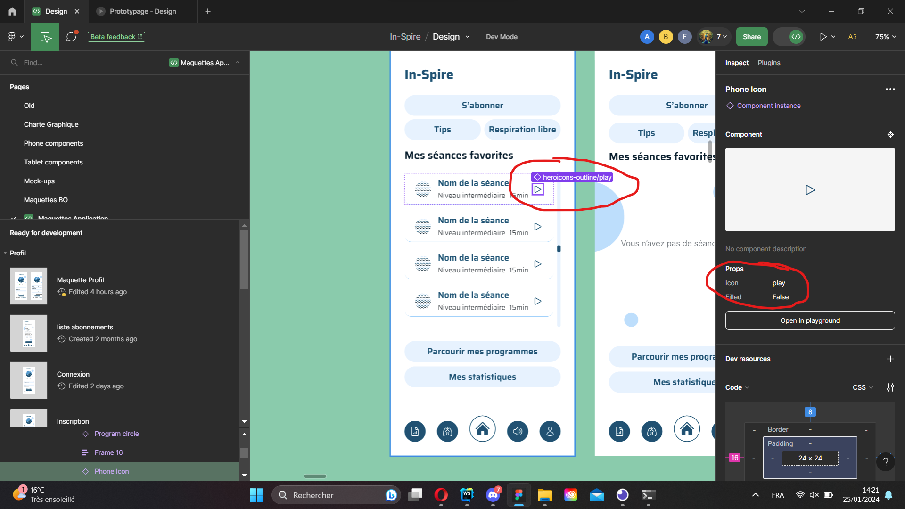

# Importer et utiliser une icône de la maquette
## Ajouter une icône depuis la librairie heroicons

> **Attention:** Ces étapes ne sont valables que pour les icônes trouvables sur [heroicons](https://heroicons.com).
> Deux icônes ne sont pas concernées, ce sont les icônes `lungs` en `outlined` et `filled`.
> Si vous recherchez ces icônes, rendez vous à la partie `Ajouter une icône à partir d'un SVG` présente plus bas.

### Etape 1 - Trouver le nom de votre icône.
Pour trouver le nom de l'icône que vous recherchez, rendez-vous simplement sur les maquettes, passez en mode dev via le bouton toggle en haut à droite de la fenêtre puis sélectionnez votre icone.
Vous trouverez le nom de votre icône dans l'encart de droite. *(cf. image ci-dessous)*.



### Etape 2 - Importer le composant associé depuis `React Native Heroicons`
Modifier en fonction du nom de votre icône et ajouter le bout de code suivant au début de votre fichier.
```typescript
import { ${Nom de votre icône en camel case}Icon } from "react-native-heroicons/{outlined|filled|mini}";
```
> Notez que l'application n'utilise que des icônes `outlined` et `filled`

**Exemple:** Si je souhaite récupérer l'icône présente dans le screenshot donné plus haut, je devrai ajouter la ligne suivante.
```typescript
import { PlayIcon } from "react-native-heroicons/outlined";
```

> **En cas d'erreur lors de l'import**
> Vous n'avez qu'à installer la librairie grâce aux commades npx suivantes:
> 
> **npx**
> ```bash
> npm i react-native-heroicons react-native-svg
> ```

### Etape 3 - Utiliser l'icône

L'icône importée s'utilise de la manière suivante :
```typescript
<IconName color="red" fill="black" size={42} />;
```

## Ajouter une icône à partir d'un SVG.

> Cette section est toujours en R&D, renseignez-vous auprès de votre repsonsable de salle.