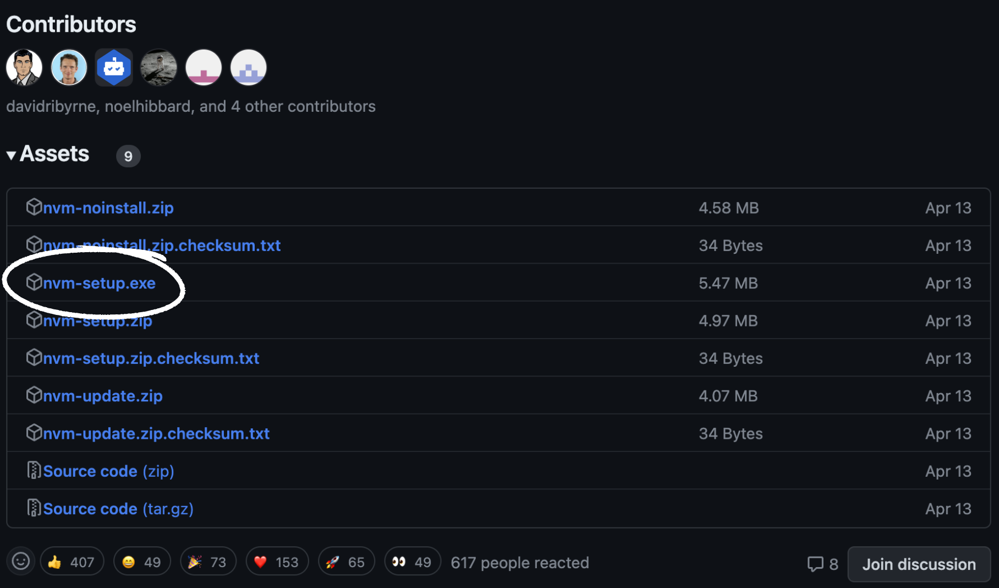

# Préparation de l'environnement de travail

Cette page vous explique les logiciels, dépendances et outils qu'il faut avoir avant de développer sur le projet.

## Introduction à Git

Git est un système de contrôle de version décentralisé très populaire parmi les développeurs. Il vous permet de suivre les modifications de vos fichiers de projet et de collaborer efficacement avec d'autres personnes. Penser à Git comme une machine à remonter le temps qui vous permet de revenir à n'importe quelle version antérieure de votre travail.

### Pourquoi utiliser Git ?

- **Sauvegarde et historique complet :** Chaque modification est enregistrée.
- **Collaboration :** Plusieurs personnes peuvent travailler sur le même projet en même temps.
- **Branching et Merging :** Vous pouvez expérimenter dans des branches séparées sans affecter le projet principal.

### Apprendre plus sur Git

Pour une introduction plus détaillée et comprendre les différentes commandes, téléchargez notre PDF résumé des commandes majeures de Git [ici](/assets/Fiche_dinformations_GIT.pdf).

### Installation de Git

Rendez-vous sur le site officiel de Git et suivez les instructions.

Le site : https://git-scm.com/

## NodeJS (via NVM)

NVM (Node Version Manager) est un outil qui va permettre de changer de versions de Node de façon simple et rapide.

**C'est quoi NodeJS ?**

Pour faire simple et rapide, NodeJS est un moteur qui permet d'exécuter le langage JavaScript côté serveur. Ici, il nous sera utile uniquement pour lancer notre serveur et gérer les dépendances

## Installation de NVM

### Windows

Aller sur le lien Github suivant et cliquez sur "Download Now!" dans la documentation en bas du code source.

Le lien : https://github.com/coreybutler/nvm-windows

Ensuite, télécharger le ficher .exe (présent sur l'image ci-dessous) et suivez les instructions de l'exécutable afin d'avoir NVM.



### Mac/Linux

```
curl -o- https://raw.githubusercontent.com/nvm-sh/nvm/v0.39.5/install.sh | bash
```

**Exécution de NVM (à faire une fois après la commande du desuss)**

```
export NVM_DIR="$([ -z "${XDG_CONFIG_HOME-}" ] && printf %s "${HOME}/.nvm" || printf %s "${XDG_CONFIG_HOME}/nvm")"
[ -s "$NVM_DIR/nvm.sh" ] && \. "$NVM_DIR/nvm.sh" # This loads nvm
```

::: tip
Une fois NVM installé, vous pouvez changer de version de Node rapidement.
:::

**Installation de Node**

Ici, on spécifie la version 16.18.0 car c'est celle que l'on veut utiliser mais on aurait très bien pu mettre une autre version.

```
nvm install 16.18.0
```

**Utiliser une version de Node**

```
nvm use 16.18.0
```

## Bonus

Une documentation supplémentaire a été réalisée pour résumer l'installation jusqu'au lancement du projet. Vous pouvez la consulter [ici](https://www.canva.com/design/DAF8MJ0LswE/zw_YaCEESlQ5nHOsfp_uOQ/view).
